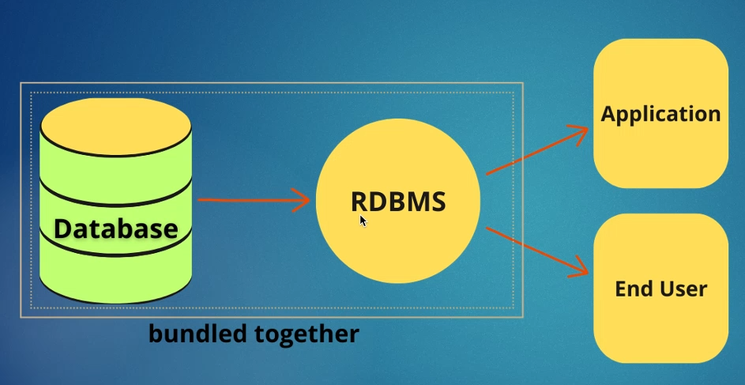

# Terminologies


## DATA
- anything can be considered as observable is DATA

## INFO
- set of fact that representes meaningful it's Information

## DB:: relational-db
- container  that stores data 
- purpose of storing data:
    - easily accessed
    - modified
    - protected
    - analyzed

## RDBMS
- system that manages DB


## SQL
- language used to communicate btwn user and RDBMS
    - read
    - write
    - create, modify and delete
    - analyze
    - build reports

- Everythings saves in Tables:: (Rows,Columns)
- related tables are connected to each other:: realted-database
- PLSQL - it's extended version of SQL ( run multiple queries run in instance ). for clarity, like table,view,trigger,sequence  procedure is a object too


## SQL COMMANDS
```set of rules to perform on RDBMS```
- **DDL**:: DATA DEFINITION LANGUAGE
    - create
    - drop
    - alter
    - truncate
- **DML**:: DATA MANIPULATION LANGUAGE
    - insert
    - update
    - delete
    - merge
- **DCL**:: DATA CONTROL LANGUAGE
    - grant 
    - revoke
- **TCL**:: TRANCATION CONTROL LANGUAGE
    - commit
    - rollback
    - savepoint
- **DQL**:: DATA QUERY LANGUAGE
    - select


## Installation
[Postgres](https://www.postgresql.org/) download page

username: admin
password: ~~admin~~


- default schemas:
	- postgres:: public
	- MSSQL:: dbo
	- Oracle:: sys